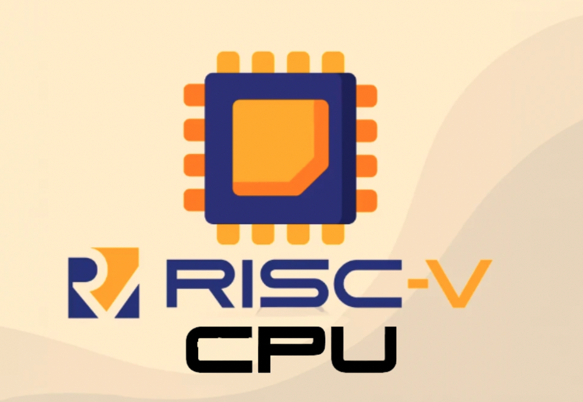

**RISC-V CPU:**
==============================



- ## Branches:
  This repository has been split up into three branches. The current branch contains the code for the single cycle RISC-V CPU. The pipeline branch and the cache branch, as the names suggest are the stretched goals mentioned in the project brief.

- ## Single Cycle branch (main):
  The results for the reference program can be found in the [tests](tests/) directory:
  1. [F1 program code](tests/f1.s)
  2. [F1 test video](tests/sc-f1.mp4)
  3. [Gaussian distribution](tests/sc-gaussian.mp4)
  4. [Sine distribution](tests/sc-sine.mp4)
  5. [Triangle distribution](tests/sc-triangle.mp4)
    
    To test the f1 code, navigate to the rtl directory using the first command below and then execute the shell file using the second one:
     ```shell
     cd rtl

     source ./doit.sh
     ```
     The [testbench](rtl/riscv_tb.cpp) has been set up in order to allow for execution of the light sequence to start **once the rotary encoder has been pressed**.

  To navigate to the pipeline branch type:
  ```bash
  git checkout pipeline
  ```

  To test the reference program on single cycle type:
  ```bash
  git checkout sc-reference
  ```

  To test the reference program on pipeline type:
  ```bash
  git checkout pp-reference
  ```

  To navigate to the cache branch:
  ```bash
  git checkout cache
  ```
  Follow test instructions to test reference program on single cycle design with cache.
  
  To test reference program in pipelined processor with cache (reference program test, since only the ram is changing) type:
  ```bash
  git checkout pipeline_with_cache
  ```

In any of the branches that test reference programs, the data in the ram can be changed from

```systemverilog
  $readmemh("reference/gaussian.mem", ram_array, 17'h10000);
```


