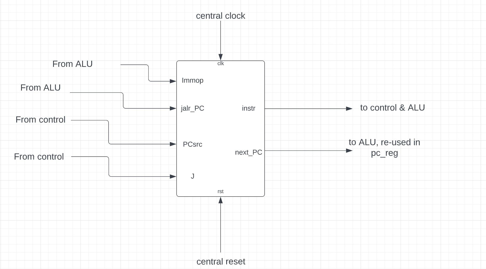
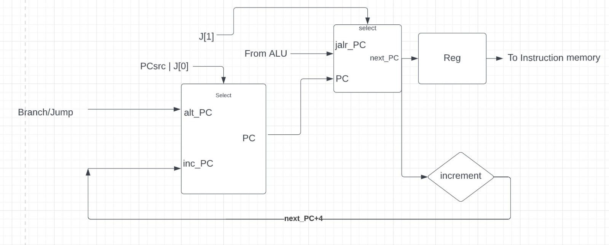
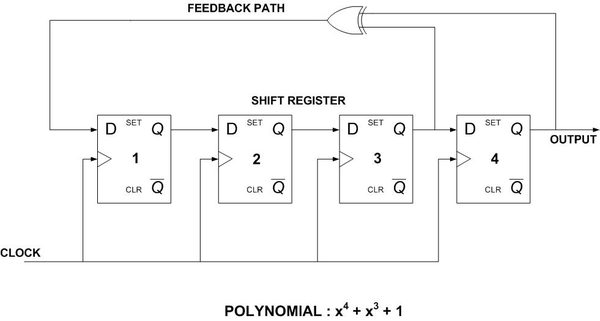
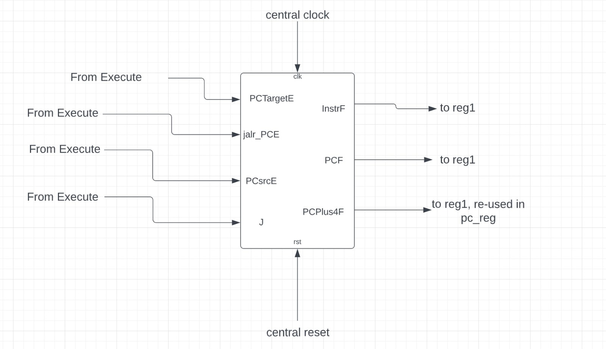

# Contribution (sk1421 - 02018546):

Note: Due to issues with syncing my local git with my GitHub account, my commits have not been reflected on my profile. The name with which all my commits have been made is my own (arnavxkohli, Arnav Kohli). I have included the relevant commits at the bottom of this document, but all the other commits (around 150 of them) [can be viewed in the commit log](https://github.com/EIE2-IAC-Labs/iac-riscv-cw-18/commits/main?after=a2c751e3dceb0eb88105e091be6df2f3789cc151+104&branch=main&qualified_name=refs%2Fheads%2Fmain).

Apart from the responsibilities mentioned below, I also took initiative and took the videos/set up the shell file as well as [Documentation](../README.md) for ease of access of the assessor. As is mentioned there, we have used 6 branches, two of these are for the cache. One of these implements the cache with a single cycle CPU. We are aware that the project specification did not ask for this, but we found it easier to scale up to the pipelined version.

All of the proof for contribution can be seen in commits and the respective folders on this branch. They are further documented with explanations below:

## Single Cycle CPU:

- ### PC Block & Instruction Memory:
  The relevant files for this part of the module can be found in the main branch, in the directory rtl/riscv-final-pc. This directory contains a test bench for the entire block, the program counter files and the rom file. The top level module for this block is called  [***top_pc.sv***](../rtl/riscv-final-pc/top_pc.sv). The block diagram for the single cycled instruction memory is:
    
    
  - #### **Functioning** :

    - **Counter & Mux:** The PC block is responsible for smooth progressing of the program. It consists of a counter (called a program counter) which moves up in increments depending upon outputs from a mux block. The mux block in question takes inputs depending on if the operation requires a branch/jump (where the address to jump to is specified in the instruction) or a regular operation. These two functions are handled by **alt_PC** and **inc_PC**.

      Apart from these two functions, jumps were handled by an input from the control block called "**J**". When J was 0, there would be no jumps. With J = 1 there would be a **jal** operation, but this was easily handled by **alt_PC**. Finally if J = 2, a **jalr** operation would be executed. This is explained in further detail below.

    - **Instruction Memory:** Apart from the counter and mux block, there is also a memory block(in this particular use case we have used a ROM, but a RAM would work perfectly fine as well). Typically a RAM would be implemented in case of a Von Neumann architecture where we require dynamic access to the memory location in case it needs to be changed mid-program. The memory block currently contains 65536 (hex FFF as per the memory map) addresses, with 32 bit instruction words stored in each of these addresses. The reasoning for this decision was due to optimization of the memory to fit the memory map provided in the project specifcation. It was decided that only 0xFFF locations would be allocated because allocating all $2^{32}$ memory address would require 4 Gigs of system memory which verilator would not be able to handle.

    - **PC Register:** To avoid a combinational loop, a register is added between the mux and the memory block. This is because at cycle 0, PC is required to determine PC. In case there was no PC register in between, this would latch and cause a combinational loop. The register initially contains 0, so this will not hamper the functioning of the program.

  - #### [**PC Register & Counter & Mux**:](../rtl/riscv-final-pc/pc_reg.sv)
    The **pcreg** module handled the creation of a register and the mux based on the picture below, it handled the mux block, as well as the pc register. 
    
    

    The mux block depends on **PCsrc**, a control input. When **PCsrc** is high, the program counter accepts input from the branch component. The Jump instruction would also require PC to be dynamically changed according to the previous PC and the offset which is stored as an immediate as part of the instruction. This functionality is common for both the branch operation and the jump operation. The only difference being the jalr operation, which allocates PC according to a value stored in a register. JALR works like a return operation when the register to which the JAL operation was stored is accessed. It allows PC to increment after returning from a subroutine. For jalr specifically, the input to the rom should come from the alu block since the operation to be performed is  **PCsrc_inter** is responsible for checking if the instruction is a jump or not. Since J is a 2 bit input which is **2'b10** when a jalr operation is requested, the most significant bit is used to allocate the PC value which also comes as an input from the ALU. When **PCsrc_inter** is low, the program counter increments by 4 (due to byte addressing). This can be seen in the code snippet below:
    ```systemverilog
    assign PCsrc_inter = J[0] | PCsrc;

    assign alt_PC = PC + ImmOp;
    assign inc_PC = PC + 32'h4;

    always_comb begin
      if (J[1]) next_PC = jalr_PC; 
      else begin
        next_PC = PCsrc_inter ? alt_PC : inc_PC; 
      end 
    end 
    ```
    The program counter ensures a one cycle delay between input PC (to calculate the increment and subsequent PC) and the output PC (which is pushed forward to the instruction memory as well as used as input PC for the next cycle). This is implemented with the code below (synchronously):
    ```systemverilog
    always_ff @(posedge clk)
    if(rst) PC <= {ADDRESS_WIDTH{1'b0}};
    else    PC <= next_PC;  
    ```
    It also contained a reset in order to allow for mid cycle resetting capabilities.

  - #### [**Instruction Memory**](../rtl/riscv-final-pc/rom.sv):
    The instruction memory module consists of a rom (rom.sv)which is loaded with instructions compiled from assembly language using the riscv assembler. The rom used for this CPU has a data width of 8 bits (since each address stores one byte - byte addressing) and an instruction width of 12 bits. This is because the memory map in the project specification demands we use at least 0xFFF or 12 bit-wide instruction addresses. Since the RISC-V ISA uses 32 bit wide instructions, 4 addresses would have to be concatenated to form one instruction.  Apart from this, the memory is allocated using a little endian representation (least significant byte is stored in the lowest of the 4 allocated addresses). This is implemented using the code below:
    ```systemverilog
    assign instr = {rom_array[PC+3], rom_array[PC+2], rom_array[PC+1], rom_array[PC]};
    ```
    Note that the assignment is asynchronous as per the specification.
    
- ### Testing and verification:
  Apart from the instruction memory block, I handled design verification and testing for the single cycle CPU. To test the CPU, I used the src folder under rtl to write code in assembly. The code was written to be a part of the F1 program but also simultaneously allow me to test the basic instructions needed by the CPU in order to implement the F1 program. These were: XOR, Shifts, Add/Sub, Branch, JAL and JALR. A more detailed explanation as to why and where these were used in particular:


  - [**fsm.s :**](../rtl/src/myprog/fsm.s) This program would switch the lights on sequentially till it reached the state where all 8 lights in the LED array were turned on, at which point it would wait a fixed amount of time before turning all of them off.
    1. The main label would set up **a5** and **t5** with the initial values. **a5** holds the value of the delay after the final state, and **t5** holds the value 1 for subtraction during the delay loop. 
    2. **lightloop** initiated the switching on of the array of LED lights.
    3. **checkdelay** would hold the state when all the lights were on till the contents of register **a5** (the delay register) reached 0.
    The looping mechanism allowed me to check that bne was indeed working as expected. This code also proved that the add operations were working correctly.
  - [**clkdiv.s :**](../rtl/src/myprog/clkdiv.s) This program allowed me to check if the jal and the jalr function were working properly. It was useful in implementing a pause between each light sequence so that I could control how much time would pass in between each light turning on. 
    The test for this program was simple: If register a0 contained 1 at the end of execution, then both the jal and jalr operations were working fine. 
    1. In the initial loop, register **a6** is set up with the value to hold execution between each light progression. Once **a0** and **a6** are initialized, a jump is performed to the main loop.
    2. The main loop titled **mloop** would decrement the value of a6 till it reaches zero, at which point the branch check will fail. 
    3. The **jalr** operation just before the end label is equivalent to a **RET** and allows the program to return from the mloop subroutine once a6 has reached 0.


  - [**F1.s :**](../tests/f1.s) This program can be found in the "tests" folder. It is the code that executes the functionality of the F1 lights. A [video](../tests/sc-f1.mp4) is also shown in the folder, and steps to execute the code are explained in the [Documentation](../README.md). This program utilized the fsm and the clkdiv from the previous program in order to progress the state of the lights and allow for creation of a delay between each light respectively. The only new additions to the code were the randomizer, for which we used the lfsr explained in previous labs, a trigger register (**a7**) which would be used to determine when the light sequence is to be initiated.
    1. On start, the program would stay in the lfsr loop till a7 was fed with a value greater than zero (more details in the testbench for the code below).
    2. The lfsr loop used **&** functions in order to isolate the third bit, the fourth bit and the least significant three bits to perform the primitive polynomial function (note that the lfsr I used was 4 bit, since 7 bits would increase the delay time significantly). This was all done in **assembly** (and so in **software**), but a **hardware representation of this code** would be:
   
  
    

    NOTE: We have **not** implemented lfsr in **hardware**, this is just an illustration.
    
    3. The isolated bits are placed in their own registers as can be seen in the code and would then be added to register **a1** before the branch check. If the branch was successful, **a1** would be stored back in **a5** which is the delay register. Otherwise, the lfsr loop would be executed and the LED array would be turned on sequentially.
    4. **mainclkdiv** was the subroutine which would execute the clkdiv function along with the **hold** label.
    5. **checkdelay** was executed after all 8 lights were turned on. As the name suggests, it would check the value of register **a5** and decrement it till it reached 0. 
    6. **maindelay** was required so that in the worst case (if the delay was 1), the lights would not turn off immediately. **maindelay** performed the same function as mainclkdiv, except the delay between each loop in **checkdelay** would be about 0.5 seconds.
    7. When the delay counter hit 0, the program jumps to **done** which shuts off all the lights and resets the trigger manually so that the program can be executed again on asserting **vbdFlag()**.


   - [**Testbench :**](../rtl/riscv_tb.cpp)
      The testbench allows execution of the f1 program at the moment, but uncommenting the lines
    ```cpp
       if (i>400000){
          vbdPlot(int(top->a0), 0, 255);
       }
    ``` 
    and commenting out the vbdBar() function would allow for testing of the reference programs. The test for the reference programs will be mentioned in subsequent sections. 

    The testbench initializes by resetting the program count, and resetting trigger, which is an input into the register file in the ALU. Trigger always maps to register **a7**. 
    ```cpp
      top->trigger = vbdFlag();
      top->rst = false;
    ```
    The code above ensures that once vbdFlag() that is the rotary encoder is pressed, trigger goes high and 1 is stored in the register **a7**. From the [f1](../tests/f1.s) code above, this register breaks the lfsr loop and initiates the lights loop, which is implemented with the code below:
    ```cpp
      vbdBar(top->a0 & 0xFF);
    ```
    It is essential that the vbuddy is in one shot mode, because otherwise trigger would stay high till it is de-asserted. The code below ensures this:
    ```cpp
      vbdSetMode(1);
    ```
    I also [recorded a video](../tests/sc-f1.mp4) of the vbuddy in operation using the testbench explained above. For details on how to emulate this go to the [Documentation](../README.md).

- ### **LUI, LBU, SB operations:**
  It was also my responsibility to add the logic for these functions to [ALU decoder](../rtl/riscv-final-controlunit/ALUDecoder.sv), the [main decoder](../rtl/riscv-final-controlunit/mainDecoder.sv), [ext](../rtl/riscv-final-controlunit/ext.sv) and the [ALU](../rtl/riscv-alu/regfileALU.sv). The proof of this can be seen in the **relevant commits** section.
  1. For the LBU instruction, I mapped the opcode to the relevant control signals and used the ext block to create the upper immediate. I used the ALU to then output **op2** which was either the Immediate or read from a register (depending on **ALUSrc** which was set to 1 using the control unit).
  2. For LBU and SB, it was a design decision to use *datatype* which would decide if a byte, word or half word should be selected. Since the *funct3* is different for LBU and SB, I had to make sure that they matched the binary generated by the assembler [(this actually caused a bug due to incorrect labelling of *funct3*)](https://github.com/EIE2-IAC-Labs/iac-riscv-cw-18/commit/f90789ff8b95f6c5fddd8c0f1ed102a4de67336a).
   
  These two operations enabled us to load the reference program into our instruction memory and start generating waveforms as can be seen in the videos linked below:

  1. [Gaussian](../tests/sc-gaussian.mp4)
  2. [Sine](../tests/sc-sine.mp4)
  3. [Triangle](../tests/sc-triangle.mp4)
---

## Pipelined CPU:
- ### PC Block & Instruction Memory:
   For the pipelined version of the RISC-V CPU to work, I changed the input and output names to match the block diagram present below. This was so that it would be easy to connect these parts in the top level module.

   

- ### Testing & Verification:
  To test the pipelined CPU with both the [reference program](https://github.com/EIE2-IAC-Labs/iac-riscv-cw-18/blob/pipeline/rtl/reference/pdf.s) and the [f1 program](https://github.com/EIE2-IAC-Labs/iac-riscv-cw-18/blob/pipeline/tests/f1.s), I needed to make some modifications to solve the data and control hazards in software. The modifications were made based on two key observations:
  1. Writing to a register and using the same register in any operation before it's value was updated after the execute cycle would lead to a **data hazard**. Due to this reason, I added three nops in between any such operations (**fetch**->**decode**->**execute** + 1 cycle to update regfile = 4 cycles, so initial instruction + 3 nops).
  2. If any instruction was present immediately after a branch operation, it would be executed before the branch condition was checked. This would lead to a **control hazard** and is undefined behaviour. This is because the branch condition is checked in the execute cycle along with inputs from **Zero** and **Branch** (**fetch**->**decode**->**execute** = 3 cycles, so initial instruction + 2 nops).
  With these modifications in mind, I executed the [new f1 code](https://github.com/EIE2-IAC-Labs/iac-riscv-cw-18/blob/pipeline/tests/f1.s) and [reference program](https://github.com/EIE2-IAC-Labs/iac-riscv-cw-18/blob/pipeline/rtl/reference/pdf.s). The test results can be found in the videos on the **pipeline** branch, details for navigating there are in the [documentation](../README.md):
  a) [Gaussian](https://github.com/EIE2-IAC-Labs/iac-riscv-cw-18/blob/pipeline/tests/pp-gaussian.mp4)
  b) [Sine](https://github.com/EIE2-IAC-Labs/iac-riscv-cw-18/blob/pipeline/tests/pp-sine.mp4)
  c) [Triangle](https://github.com/EIE2-IAC-Labs/iac-riscv-cw-18/blob/pipeline/tests/pp-triangle.mp4)
  d) [F1 video](https://github.com/EIE2-IAC-Labs/iac-riscv-cw-18/blob/pipeline/tests/pp-f1.mp4)


---
## Cache 
  In the cache block, I helped [Gavin](gavin.md) with debugging the cache by testing it with my testbench which we had access to since it was a branch of the main. I also noticed [a bug](https://github.com/EIE2-IAC-Labs/iac-riscv-cw-18/commit/389aa31b30a7ea1b3ecae87960eebc13914b3922) in the initial version, we assumed that using !WE would allow us to capture all cases where there was a read operation, but this isn't the case because during operations like add, sub, lsl and all the others, WE was 0. To circumvent this issue, I suggested that we make MemWrite a 2 bit number (00 - nothing, 01 - read, 10 - write).
  1. [Gaussian distribution](https://github.com/EIE2-IAC-Labs/iac-riscv-cw-18/blob/pipeline_with_cache/tests/cache-reference.mp4)
   
  For more details on navigating to the cache branch, look at the [Documentation](../README.md)

---
## Reflection and possible improvements:
- In the fsm program, it is possible to save register t5 from being used at all by instead replacing the decrement with: 
    ```asm
    addi a5, a5, -1
   ```
  This is a minor change, as it would not affect the functioning of the program except for a microscopic delay due to loading of the register file with 1. Where this could be problematic, was in case of a bigger program, if more registers were required in order to facilitate more variables, or if the given subroutine was run enough times to cause a substantial delay.
- Also in the fsm program, the effect of switching the lights on could be accomplished by using an lsl operation, along with an increment at each stage.
- It was possible to add logic for load half word (LH) and all the other load/store operations, but since they weren't used by either our F1 program, or the reference programs, we decided not to add them.

---
## Relevant commits:
1. [Added LUI](https://github.com/EIE2-IAC-Labs/iac-riscv-cw-18/commit/dc5b1444dcc8f71a18da49be685a7485d17b3a76)
2. [Fixed bugs in LBU and SB](https://github.com/EIE2-IAC-Labs/iac-riscv-cw-18/commit/f90789ff8b95f6c5fddd8c0f1ed102a4de67336a) 
3. [Added logic for op5 along with Harry](https://github.com/EIE2-IAC-Labs/iac-riscv-cw-18/commit/c12b0cbbe6bd0875363700cd2f9e53ea8bcc3d82)
4. [Modified PC to allow jalr using inputs from ALU](https://github.com/EIE2-IAC-Labs/iac-riscv-cw-18/commit/9ba29b02f1df5b4c11d5584657f0eb22c538f94a)
5. [Added logic in control block for jumps](https://github.com/EIE2-IAC-Labs/iac-riscv-cw-18/commit/dc46ec40e186b8df67feb353696fa1ddc9a294bb#diff-9e097b30605d471974f76a3983ef7ebc64d5b823df6140ca2a5db5692ec1971e)
6. [Debugged Control and added defaults](https://github.com/EIE2-IAC-Labs/iac-riscv-cw-18/commit/c5db2da0fa9eb48fe8370a7db2c0e264afc80e4c)
7. [Added jumps to PC block](https://github.com/EIE2-IAC-Labs/iac-riscv-cw-18/commit/d113900e8ffbc0f16ea7ff48fec60cac391d4eaa#diff-de8c2bd4c5bcf5671f203b5720abaf7a86bf796e6dbe5ffdb3341bf0f268f273)
8. [Made data memory little endian](https://github.com/EIE2-IAC-Labs/iac-riscv-cw-18/commit/b2fb426193bf4743a36e041c903fe88a37a43b5f)
9. [Created the initial version of the data memory](https://github.com/EIE2-IAC-Labs/iac-riscv-cw-18/commit/9731e8db4b6acc4904fd35dabb4d029d2b53cd8c)
10. [Adding nops and debugging jump/branch](https://github.com/EIE2-IAC-Labs/iac-riscv-cw-18/commit/c09d5f40656779f54d54e6add81a4dce7c7ca8cf)
11. [LUI in pipelined CPU](https://github.com/EIE2-IAC-Labs/iac-riscv-cw-18/commit/c7a0c4751418c031bb3062972ad4b5ef35695aae)
12. [Debugging pipeline top level module](https://github.com/EIE2-IAC-Labs/iac-riscv-cw-18/commit/61475dec9c4afdc734faaff9ba705234804c6fe2)
13. [More debugging](https://github.com/EIE2-IAC-Labs/iac-riscv-cw-18/commit/f98fc821255cfbf7f2118290ca647bf9776146e6)
14. [JALR input from ALU bug fix](https://github.com/EIE2-IAC-Labs/iac-riscv-cw-18/commit/7ecccb3ae8805b2316b9d7dcf36ab72e0e67abf2)
15. [Renamed signals for ease in connecting during pipelining](https://github.com/EIE2-IAC-Labs/iac-riscv-cw-18/commit/74c4f6d3fb7976e54d12608639a7652e5115a191)
16. [Ensured jump is read on the same cycle as execute](https://github.com/EIE2-IAC-Labs/iac-riscv-cw-18/commit/dc46ec40e186b8df67feb353696fa1ddc9a294bb)
17. [Fixed MemWrite in Cache](https://github.com/EIE2-IAC-Labs/iac-riscv-cw-18/commit/389aa31b30a7ea1b3ecae87960eebc13914b3922)


---
###### Videos by : Arnav Kohli
###### Authored by : Arnav Kohli