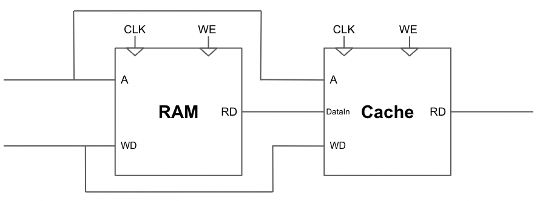
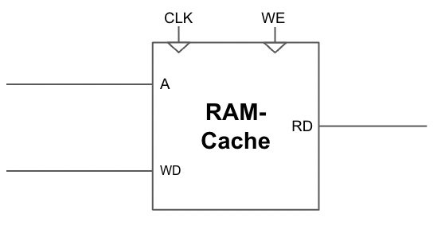
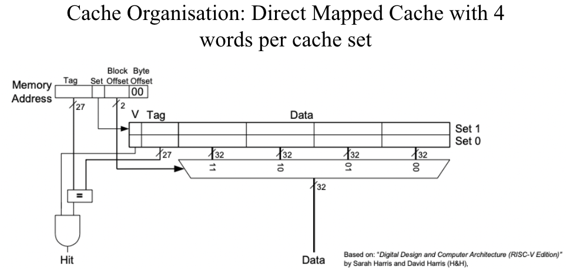

---

# Contribution:

Served as the principal author for the arithmetic logic unit (ALU), register file, ram and the combined ram-cache memory unit. I also built test benches for each of these components to validate that they work as expected before they’re implemented in the complete CPU. 

---

## ALU

- ### Preliminary Design

To create the ALU, I identified all instructions required to implement the Lab 4 binary counter task. These were: bne and addi, so only a 1-bit ALU_ctrl signal was needed to differentiate between the 2 instructions and they were both implemented using in-built operations. 

The ALU had 2 output signals, ALUout which was the result of the 2 inputs after applying certain arithmetic, and eq which was HIGH if the 2 ALU inputs were equal, regardless of the instruction being bne or beq. The control unit applied a signal to invert eq depending on if the instruction was bne. This ensured the same logic could be used for both bne and beq instructions, which simplifies the ALU.
  
- ### Complete Design

This ALU served as the foundation for the ALU used in the complete RISC-V processor. I expanded upon it by using a 4-bit ALU_ctrl signal to differentiate between 16 instructions. As I introduced new logic to the ALU, I emphasized the design decision of reusing existing ALU logic for new instructions. For instance, the SUB, BNE and BEQ instructions all use the same ALU logic as shown below: (add code snippet)

```systemverilog
always_comb begin
  case (ALU_ctrl) 
     ...
    4'b0001: begin
      ALUout = op1 - op2; // Subtraction logic
      if(ALUout==0) eq = 1; // Condition to evaluate equality
      else eq = 0;
    end
    ... 
 end
```

A mistake made was trying to overuse existing ALU logic instead of using a SystemVerilog operator. In the shift left logical (SLL) instruction:

> SLL rd rd1, rd2
> 
> rd = rs1 << rs2

I considered using the ADD logic to add rs1 with itself rs2 times. This has the same effect as shifting rs1 left by rs2 bits, and reuses an existing ALU logic. But, this requires overhead like introducing registers to store the ALU output and then feed it as an ALU input to prevent a combinational loop. This operation would take multiple clock cycles to get the desired output, therefore, it was more suitable to create a new ALU logic which uses the shift operator, an inbuilt operator that performs the shift operation immediately.

## Register File

- ### Design Decisions

To create the register file, I instantiated a set of 32 registers each storing a word of 32-bit size. Registers are given specific uses as mentioned in Lecture 6 Slide 8. The register x0 only holds a constant value 0 which is useful for instructions like writing an immediate to a register:

```systemverilog
addi x1, x0, 255 // Register x0 is used for rs1 as it has no effect on immediate
```
To ensure the value in register x0 isn’t overwritten, a conditional evaluates the destination register (rd) to ensure it isn’t x0.

Finally, a design decision was to initialize each register in the register file with constant value 0 during start-up. After declaring the register file using a vector, the value held within each register is unknown and could effect the program result if a value is used from the register before an instruction writes to it. Therefore, to have full knowledge of register values throughout the program execution, the design decision of initializing the register file with 0s was made.

## RAM-Cache

As an extension to the pipelined processor, I implemented a data cache to the main memory giving a new combined memory component called: RAM-cache. 

- ### Iteration 1 of Cache

Initially, I planned on creating a separate cache component that would be wired to the existing RAM. 



The cache module has input DataIn that would be stored in a cache set if there was a miss. However, as DataIn is the data stored in main memory address A, then the cache is unnecessary as regardless of a hit or miss, the data from main memory is fetched to be inputted into the cache component.

- ### Actual Cache Implementation

<div id="image-table">
    <table>
	    <tr>
    	    <td style="padding:10px">
        	    
      	    </td>
            <td style="padding:10px">
            	
            </td>
        </tr>
    </table>
</div>

In the actual design, I combined the RAM and cache into one memory component called the RAM-Cache. This component has input address A where bits A[7:4], known as the set bits, are used to establish cache set location. Each set stores 4 32-bit data values, so bits A[3:2] known as the block offset is used as the control signal for a multiplexer which outputs the data stored in the corresponding block. Code to select correct word from cache set:

```systemverilog
always_comb begin
  if(cache_data[136]) begin //check valid bit
      if(cache_data[135:128]==A[15:8]) begin //compare tag
        assign RD = A[3] ? (A[2] ? cache_data[127:96] : cache_data[95:64]) : (A[2] ? cache_data[63:32] : cache_data[31:0]); //word to output
        assign flagMiss = 1'b0; //hit
      end
    ...
end
```

To check for a cache hit, the most significant bit of the data stored in the cache set, the valid bit is evaluated. Additionally, bits A[15:8] is compared with the cache’s tag to determine whether the cache contains the requested data. If the following conditions are satisfied, the word is fetched from the cache and flagMiss is LOW.

A direct mapped cache with 4 words per cache set was chosen for the cache organisation as it considers both temporal and spatial locality. In the situation of a cache miss, the data is read from the main memory and flagMiss is HIGH. A conditional then evaluates flagMiss and writes the recently accessed data from the main memory into a specific block within the cache set. The neighboring memory locations for the given address are also simultaneously fetched from main memory and written to the same cache set in the remaining blocks. This allows data to be fetched from the cache set even if the address containing the data wasn’t previously queried. Furthermore, smaller data sizes such as bytes and halfword stored and loaded onto block in acache set by evaluating block and byte offset.

All write operations were executed in an always_ff block that executes at a positive edge, whereas all read operations were done in an always_comb block. This ensures that the clock cycles to read and write to the RAM-cache is identical to RAM which ensures that programs are still able to execute normally. In the case of a more complex CPU design, this implementation of the cache ensures that fetching from cache is far more quicker than reading from main memory.

```systemverilog
always_ff @(posedge clk) begin
    if (flagMiss) begin //Write to cache if miss at positive clock edge
      //Cache set given by A[7:4].
      //RD1, RD2, RD3, RD4 are successive data values from main mem.
      cache_array[A[7:4]] <= {1'b1, A[15:8], RD4, RD3, RD2, RD1};  
    end
end
```

## RAM (in Single-Cycle CPU)

Based on the RISC-V specifications, the RAM component uses byte addressing and the addresses are offset by 17’h1000 which allowed for easier debugging. This was implemented in the RAM declaration: 

```systemverilog
logic [BYTE_WIDTH-1:0] ram_array [17'h1FFFF:17'h10000]; 
```
To implement store byte, word and halfword instructions, a special design decision was to introduce a control signal called DataType into the RAM. This is a 2-bit signal evaluated by a case statement that concatenates and outputs successive bytes depending on if dataType is 00 (word), 10 (halfword) or 01 (byte).

Remainder of the bits, in the case of halfword or byte, are filled with 0s for unsigned extension to 32 bits. Similarly, memory write operations evaluate dataType to determine whether to write only to address A, in the case of store byte instruction, or the next 3 successive addresses, if we have a store word instruction and therefore dataType is 00 (word).

## Testing and Verification

## Reflection

Through this project, I have grown my understanding of the RISC-V architecture. Previously, I had a theoretical grasp of how instructions are translated into operations, however, by creating the components making up the RISC-V architecture on SystemVerilog, I applied theory into practice which gave me insight into details that I previously overlooked. 

For instance, I assumed all data could be located by simply searching for the location address in memory. However, as the RAM component was byte addressed, a word could only be created by concatenating the next 3 successive addresses. For the RAM-cache component, as each cache line stores 4 word blocks that each consist of 4 bytes, a store/load byte operation required evaluating the block and byte offset, given by the input address, to locate the byte to be outputted as shown below.

```systemverilog
always_ff @(posedge clk) begin
    ...
    case([A[3:2]) //statement to determine which block in the cache set to write to
    	2'b00: begin
	case([A[1:0]) //statement to determine which byte in the block to write to 
		2'b00: begin
		//writing a specific byte in a block in the cache set
		cache_array[A[7:4]] <= {1'b1, A[31:8], cache_data[127:96], cache_data[95:64], cache_data[63:32], cache_data[31:8], WD[7:0]};
		end
		...
    endcase
end
```
This gave me an understanding of the smaller nuances that help the cache and RISC-V architecture function. 

Our approach to building the complete CPU was constructing individual components, combining them in a top level module for ALU, control unit and PC and combining these components to form the complete system. This bottom-up and modular design approach was beneficial as I was able to repurpose components from the single-cycle CPU to build the different stages of the pipelined processor. So, from this project I have learned how to approach large programming tasks and I have improved my SystemVerilog proficiency.


## Future Changes

With more time available, I would change the cache organization to be 2-way associative cache with LRU replacement. Currently, I have implemented direct-mapped cache with 4 word blocks per set as it allows for spatial locality. This is optimal for the reference program as we’re reading and writing data in successive memory addresses. With spatial locality, these data values can now be easily fetched from the cache when its address is inputted. 

For more general programs, a 2-way associative cache allows for less cache misses and maximizes temporal locality by only replacing the least recently used way in the cache line.

