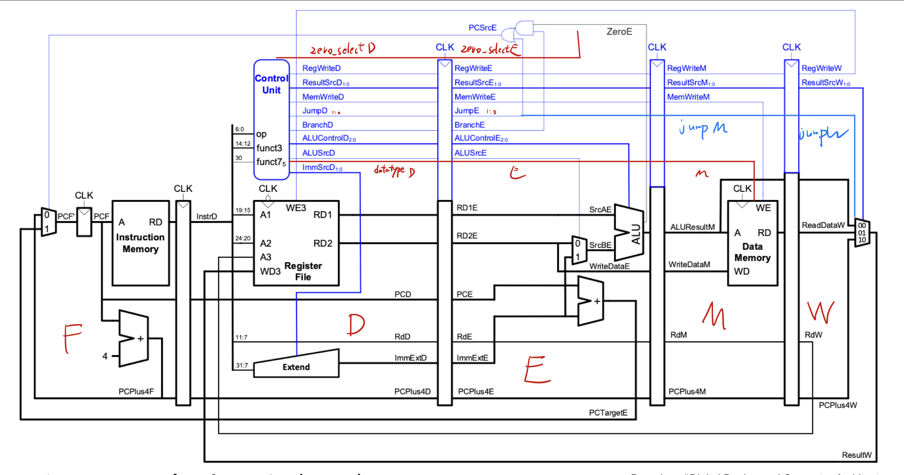

# **Single cycle CPU** &nbsp; Junyi Wu

## Contribution

In this part of the project, I was responsible for creating the top module to connect all the components and fix syntax errors in `top.sv` and individual components. I also wrote the initial version of `test bench`.

- ### **Test Bench**

The test bench is a C++ file that executes the whole CPU design. It's not complicated, what it needs to do is initialize three parameters, and interact with Vbuddy to display certain output. Details of `riscv_tb.cpp` is shown in [arnav.md](arnav.md).


- ### **Top Module**
  
The top Module is an important part, It connects all components. To implement additional Instructions, a few changes have been made. Apart from `BNE` and other instructions at have been covered in the lectures, Instuctions `JALR`, `JAL`, and word, half-word and byte operation like `lw`, `lbu` have been added. 

1. #### `J`
   For the `JALR` and `JAL` operations, two-bit control signal jump `J` is added.
   |Operation   | J     |
   |:--------:  |:-:    |
   |JAL         | 01    |
   |JALR        | 10    |
   |other       | 00    |
2. #### `Datatype`
   `Datatype`, which is used to decide word operation, byte operation, or half-word operation.
   |Operation   | Datatype|
   |:--------:  |:-:    |
   |lw          | 00    |
   |lbu         | 01    |
   |lhu         | 10    |
   |sw          | 00    |
   |sb          | 01    |
   |sh          | 10    |

3. #### **ALU change**
   `jalr_PC` is created as output from component `ALU`. It's the PC value for `JALR` instruction. `JALR` use the same `ALU_ctrl` value as `add` (0000), and has the same value as `ALU_out` in that case. When `ALU_ctrl` is not 0000, `jalr_PC` has a value of 0.

4. #### **PC change**
   `pc_reg` now choose between three values instead of two: `jalr_PC`, `inc_PC` (PC + ImmOp) and `alt_PC` (PC + 4).

- ### **Debug**
Most of the errors were syntax and connection errors, so I didn't keep track of them. I documented some common errors, so others can prevent them. (they maynot appear in the final repo)

---

# **Pipeline**

## Contribution

In this part of the project, me (Junyi WU) and Harry each created two registers, I assembled the top module and fixed syntax errors and connection errors.

Pipeline registers also delay outputs from the control unit. This can make sure the right control signals can be delivered to the right component at the right moment.

---
## Pipeline assemble

**To make the code easier to read, and make debugging easier, the CPU is divided into 5 parts, F, D, E, M, and W from left to right.**



Four registers are added into the design, `reg1 - 4`. `reg1` is rather simple, it's connected right after the Instruction Memory. `register 2,3 and 4`, however, need to be connected inside the ALU. So ALU block is divided into four parts, `regfile.sv` (Register File), `alu_e.sv`, `ram.sv` (Data Memory), and `alu_w.sv`. These parts are connected by three registers.

Apart from the signal given in the slides, we added some more signals and made some changes.

1. `Jump` signal was extended to block `W`, because, in our design, the `Jump` signal is required in `alu_e`.

2. To generate the signal `PCSrcE`, the control unit gives a new output `Zero_select`. It passes through register2 and stops at block `E`. Below is the code for `PCSrcE`.
   
```systemverilog
logic PCsrcE_inter;

assign PCsrcE_inter = (Zero_selectE ? !ZeroE : ZeroE) & BranchE;

assign PCsrcE = PCsrcE_inter | JumpE[0];
```
----
# Mistakes and Experience

1. Many components have different names for the same signal. This caused many mistakes when assembling the CPU, especially when assembling the Pipeline version.
   
- discuss with the team in advance, decide all the names or the rule of naming.

2. `Data-Width` and `Address-Width` are two parameters used in almost every components, but that value is different in different components. So when other people use the components (add parameters), operation like shown in the example will cause number of bits doesn't match.
    
```systemverilog
input logic [ADDRESS_WIDTH-1:0] a0
```

- In components like `ram.sv` or `top_pc.sv`, parameters can make it easier for changing the Address-width and Data_width, but it's not necessary for every components to have them. Removing redundant parameter can make the code more efficient.

3. Control signals and corresponding instructions can be confussing for those who don't understand instruction set well.

- These important informations should be documented in the `readme.md` file.

---

# Evidence

Commits corresponding to my contribution can be found here. 

**Note:** Many of the commits are in the old git project, and may not be found in the final assignment. Those commits will be shown seperately.

---
### Old project

#### write `ext.sv`
- [sign extension](https://github.com/GavinVasandani/Lab4-Reduced-RISC-V-Architecture/commit/acd427de9226d47c882ad4a16817afc41bf132b6)

#### initial `riscv_tb.cpp` and `top.sv` added
- [initial testbench and top module](https://github.com/GavinVasandani/Lab4-Reduced-RISC-V-Architecture/commit/0dc84ec7b69aa3cb8f17030e464595edfb6ce237)

#### Debug
- [fix some error, add common bugs in readme.md](https://github.com/GavinVasandani/Lab4-Reduced-RISC-V-Architecture/commit/b7afb35451e3b623daa2d2cffdd5e137b168cdfc)
- [General debug](https://github.com/GavinVasandani/Lab4-Reduced-RISC-V-Architecture/commit/592600061d23f121ad5caa4b713a121c18e0cc41)
- [Small change](https://github.com/GavinVasandani/Lab4-Reduced-RISC-V-Architecture/commit/cdbafc98e91de73d1278ebd823cc1c311d8055a7)
- [Fixed some bugs in top.sv and copy components form individual folder to test folder](https://github.com/GavinVasandani/Lab4-Reduced-RISC-V-Architecture/commit/ac0ef45fdb23184b45b077a06b05e491326a8bc8)
- [top.sv debug](https://github.com/GavinVasandani/Lab4-Reduced-RISC-V-Architecture/commit/d367ec775618bf284ff1498812756ca89f08cb41)
- [top.sv debug](https://github.com/GavinVasandani/Lab4-Reduced-RISC-V-Architecture/commit/9aafa02b5876adf8c3b3664717a230274e307fe7)
- [control unit debug](https://github.com/GavinVasandani/Lab4-Reduced-RISC-V-Architecture/commit/a7ad1a239cfcbce72de4290a826bc6b302c568b3)
- [PC debug](https://github.com/GavinVasandani/Lab4-Reduced-RISC-V-Architecture/commit/f5f7ff4857715090c66299c93caee184f0726b12)
  

### New project
Components were moved from old project to this new project

#### Debug
- [control unit debug](https://github.com/EIE2-IAC-Labs/iac-riscv-cw-18/commit/260e64ef3a2d798e87c55a24cb2d867fca9f2da8)

---

### **Pipeline**

### Register & test bench
#### `reg3` and `reg4` creation
- [create reg3 and reg4](https://github.com/EIE2-IAC-Labs/iac-riscv-cw-18/commit/4757cde1f0c9c9b799e0054e5cfab37c77202db5)
#### `reg1.sv`
- [add reg1 in top.sv](https://github.com/EIE2-IAC-Labs/iac-riscv-cw-18/commit/2479c9006b288790084596ab357be28d93f1569e)
- [add reg1 in top.sv and fixed some bug](https://github.com/EIE2-IAC-Labs/iac-riscv-cw-18/commit/620a4a6fc8508cd4a691759a912684b8d1120991)

#### `reg2.sv`
- [add reg2 and components of ALU in top.sv](https://github.com/EIE2-IAC-Labs/iac-riscv-cw-18/commit/1d3cbfd43e8abe4a1d4bdc7391e9dc4b7b1ed37e)

#### `reg3.sv`
- [add reg3 in top.sv](https://github.com/EIE2-IAC-Labs/iac-riscv-cw-18/commit/75a8a6b3506245404f4c17646f33054df105c2bd)

#### `top.sv`

- [add all pipeline variable and fixed some bug](https://github.com/EIE2-IAC-Labs/iac-riscv-cw-18/commit/fe63d2979b14a3e3f12f9e7a91388530f2dec3fc)

#### Debug
- [fixed many bugs](https://github.com/EIE2-IAC-Labs/iac-riscv-cw-18/commit/be76e9ba2ea7758fe1eb38365455f6bee2fd5bc6)
- [general debug](https://github.com/EIE2-IAC-Labs/iac-riscv-cw-18/commit/1ec9bbbf0e954719e5cc4dafd784f8dbf4035182)
- [general debug](https://github.com/EIE2-IAC-Labs/iac-riscv-cw-18/commit/20a3207d203c8d64bde2f92d4d3a7b4bd2d45f54)
- [general debug](https://github.com/EIE2-IAC-Labs/iac-riscv-cw-18/commit/06bafeb91fd2eb0b3697459bda0c6a7239c0f455)


