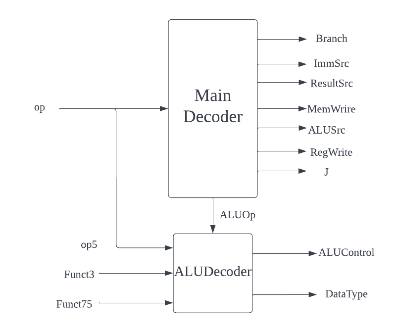

# Contribution:

The commit evidence could also be found in https://github.com/GavinVasandani/Lab4-Reduced-RISC-V-Architecture
This was our old repo, one person transfered my work to this repo.
- ## Introduction:
    - This lab report will provide an overview of the control unit implemented in a RISC-V processor written in SystemVerilog. This report will discuss the design and implementation of the control unit, as well as any challenges encountered during the development process.

- ## Control Unit & Sign Extension:
    - **Main Decoder:** The mainDecoder takes the input of last 7 digit from the instruction. This is known as opcode(**op**), which specify different type of instruction. There are mainly 6 types of instruction -- Load, Store, I-type, R-type, B-type and Jump type. Each of these type sends same control signals like **regWrite** and **ImmSrc**. One thing to note here is that JAL and JALR instruction are different in terms of the opcode and function. So it is good to write them seperately. This block is in combinational logic, and each instruction was differenciated from **op** using case statement.
    ```systemverilog
        case(op)
            7'b0000011: begin           // Load
                RegWrite = 1;
                ImmSrc = 3'b000;
                ALUSrc = 1;
                MemWrite = 0;
                ResultSrc = 1;
                Branch = 0;
                ALUOp = 2'b00;
                J = 2'b00;
            end
            7'b0100011:                 //Store
                //set all signals
            7'b0110011:
                //.....

    ```


    - **ALU Decoder:** The mainDecoder provides the information of the instruction type (**ALUOp**).  Each individual instruction is determined by function 3(**funct3**) and the 5th digit of function7(**funct75**). ALUDecoder takes in ALUOp as well as **funct3** and **funct75**. This gives the **ALUControl**, which tells what ALU needs to do. I discussed with Gavin who is doing ALU, and we decided to add a new variable **dataType** that specify whether to load word/half word/byte. There are many instructions belongs to ALUOp, so I used case statement similar to the code above. Diagram below shows the low-level overview of the control block and the relationship between 2 decoders.
    
    - 

    - **Sign Extension:** To extend a 2's complement number, we made copies of the sign bit the add to the front. In order to use the 32-bit instruction space efficiently, immediate signal may have appear everywhere exept for the opcode. These information could be find from the look up table in risc-v spec. Code below shows 2 examples of extending Imm from different location.
    ```systemverilog
        always_comb 
            case(ImmSrc)
                3'b000:             //Immediate and JALR
                    ImmExt = {{20{imm[31]}}, imm[31:20]};
                
                3'b001:             //Store
                    ImmExt = {{20{imm[31]}}, imm[31:25], imm[11:7]};

    ```


- ## Pipelining
    - 4 registers is added to the top level. I was resiponsible for the **execute** and **Memory Read/Write** stage. The main challenge in this part was the designing process. We have introduced new signal which is not mentioned in lecture. I also need to communicate with Gavin about splitting ALU into 3 parts. This is because parts of ALU was for **Decode**, **Execute** and **Memory Read/Write** stages. There should be 1 register between each stage. My work also include debugging after we connected all registers.

- ## Mistakes and Experience
    - **Challenges:** The main challenge encountered during the development of the control unit was the complexity of the decoding logic. The lookup table had to be found in the risc-v spec, which was a time-consuming process. Additionally, I need to understand how the whole CPU work in order to think about what control signal to output. 
    - **Mistakes:** When I was testing my top level control.sv, I realized it is combinational logic unlike other components. I have to add a tempory clk signal for testing. In terms of logic, there was a case I haven't thought about - For subtract operation, the **funct7[5]** should be 1. However **funct7[5]** could also be in immediate signal for add operation, which is considered as same set in ALUDecoder. This leads to error in special cases. This was solved by include **op[5]** in ALUDecoder.
    - **Experience:** 